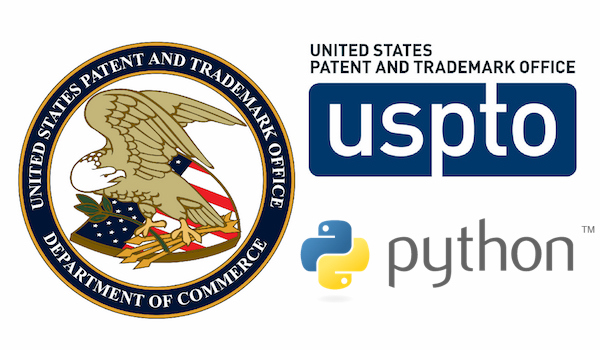

<p align="start">
  <a href="https://vuetifyjs.com/en/" target="_blank">
    
  </a>
</p>
# United States Patent and Trademark (USPTO) Data Parser

A python tool for reading, parsing, and finding patent using the United States Patent and Trademark (USPTO) [Bulk Data Storage System](https://bulkdata.uspto.gov/). This tool is designed to parse the Patent Grant Full Text Data section, which contains full text of each patent grant issued weekly (Tuesdays) from January 1, 1976 to present (excludes images/drawings).

## Requirements

- Python >= 3.5
- Pandas
- Beautifulsoup4 >= 4.6.3

## Installation
```python
from uspto import *
```
## Usage
### Get a list of the files available for a specific year
```python
file_list = get_patent_files_by_year(2008)
```
### Download file to disk
```python
url = 'https://bulkdata.uspto.gov/data/patent/grant/redbook/fulltext/1999/pftaps19990406_wk14.zip'
download_file_to_disk(url,'target/path')
```
### Read and parse single file data
#### 1- For the period 1967-2001, files are in txt format and the following data items are can be parsed:
* **INVT**: inventor information.
* **ASSG**: assignee information.
* **PRIR**: foreign priority information.
* **REIS**: reissue information.
* **RLAP**: related application information.
* **CLAS**: classification information.
* **UREF**: us reference information(citations).
* **FREF**: foreign reference information.
* **OREF**: other reference information.
* **LREP**: legal information.
* **ABST**: abstract information.
* **GOVT**: government interest information.
* **PARN**: parent case information.
* **BSUM**: summary information.
* **DETD**: detailed description information.
* **CLMS**: claims information.
* **URL** : adds the URL to the bibliographic information.

##### From URL
The code below will parse all patents for the provided zip file (year 1980) in the URL and extract inventor and assignee data. It will read and parse a txt file in memory without downloading it to disk.
```python
url = 'https://bulkdata.uspto.gov/data/patent/grant/redbook/fulltext/1980/pftaps19801230_wk53.zip'
items = ['INVT','ASSG']
data = read_and_parse_from_url(url,items)
```
##### From disk
 The code below reads a txt file (same as in the link above) that has already been downloaded to disk and returns inventor and assignee data.
```python
data = read_and_parse_file_from_disk('../data/pftaps19801230_wk53.txt',['INVT','ASSG'],'txt')
```

#### 2- For the period 2002-2004, files are in xml-version2 format, and the following items can be parsed
* **INVT**: inventor information.
* **ASSG**: assignee information.
* **PRIP**: foreign priority information.
* **REIS**: reissue information.
* **RLAP**: related application information.
* **CLAS**: classification information.
* **CITA**: us reference information (citations).
* **OREF**: other reference information.
* **LREP**: legal information.
* **ABST**: abstract information.
* **GOVT**: government interest information.
* **BSUM**: summary information.
* **DETD**: detailed description information.
* **CLMS**: claims information.
* **URL** : adds the URL to the bibliographic information.

##### From URL
The code below will parse all patents for the provided zip file (year 2002) in the URL and extract inventor and assignee data. It will read and parse a xml-version2 file in memory without downloading it to disk.
```python
url = 'https://bulkdata.uspto.gov/data/patent/grant/redbook/fulltext/2002/pg020101.zip'
items = ['INVT','ASSG']
xb = read_and_parse_from_url(url,items)
```
##### From disk
 The code below reads a xml-version2 file (same as in the link above) that has already been downloaded to disk and returns inventor and assignee data.
```python
data = read_and_parse_file_from_disk('../data/pg020101.xml',['INVT','ASSG'],'xml2')
```
#### 3-  For the period 2003-present, files are in xml-version4 format, and the following items can be parsed
* **INVT**: inventor information.
* **ASSG**: assignee information.
* **PRIP**: foreign priority information.
* **CLAS**: classification information.
* **CITA**: us reference information (citations).
* **OREF**: other reference information.
* **LREP**: legal information.
* **ABST**: abstract information.
* **DETD**: detailed description information.
* **CLMS**: claims information.
* **URL** : adds the URL to the bibliographic information.

##### From URL
The code below will parse all patents for the provided zip file (year 2008) in the URL and extract inventor and assignee data. It will read and parse a xml-version4 file in memory without downloading it to disk.
```python
url = 'https://bulkdata.uspto.gov/data/patent/grant/redbook/fulltext/2008/ipg080101.zip'
items = ['INVT','ASSG','PRIP','CLAS','CITA','OREF','LREP','ABST','DETD','CLMS','URL']
xb = read_and_parse_from_url(url,items)
```
##### From disk
The code below reads a xml-version4 file (same as in the link above) that has already been downloaded to disk and returns inventor and assignee data.
```python
data = read_and_parse_file_from_disk('../data/ipg080101.xml',['INVT','ASSG'],'xml4')
```

